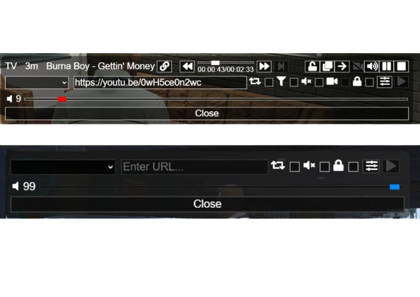

# PMMS FiveM Rework

## Introduction
This is a complete rework of the **PMMS FiveM** script, bringing a fresh new design, improved performance, and enhanced features for an optimal in-game music experience.

## Features
- 🎵 **Modern UI**: A sleek and improved interface for better user experience.
- 🎚️ **Enhanced Controls**: More intuitive music player controls.
- 🔄 **Synchronization**: Better sync between players for a seamless experience.

## Installation
1. Download the latest version of **PMMS FiveM Rework**.
2. Extract the folder and place it in your FiveM resources directory.
3. Add `start Jh-Pmms` to your `server.cfg`.
4. Restart your server and enjoy!

## Configuration
Edit the `config.lua` file to customize:
- Default volume settings
- UI theme options
- Allowed audio sources

## Credits
Developed by https://github.com/kibook/pmms with contributions from the FiveM community.

## License
This project is under the [MIT License](LICENSE).
